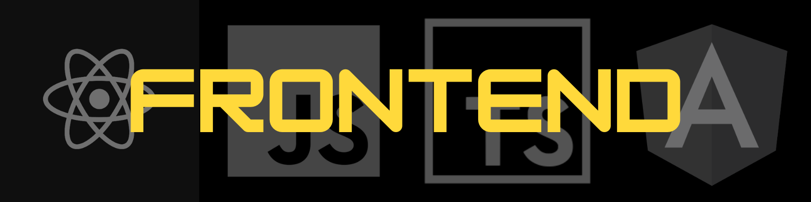

<h1 align="center">Hello there, it's Ermek</h1>
<h3 align="center">A frontend developer from Kyrgyz Republic</h3>

---
#### :computer: Tech Stack:

    
  #### :hammer: Tools:
  
  
  
  
  
  
  #### 🫂: Forums
  
  
  
  

  

     
  

  <h3>My Socials</h3>
    
    
    
  
  
 

